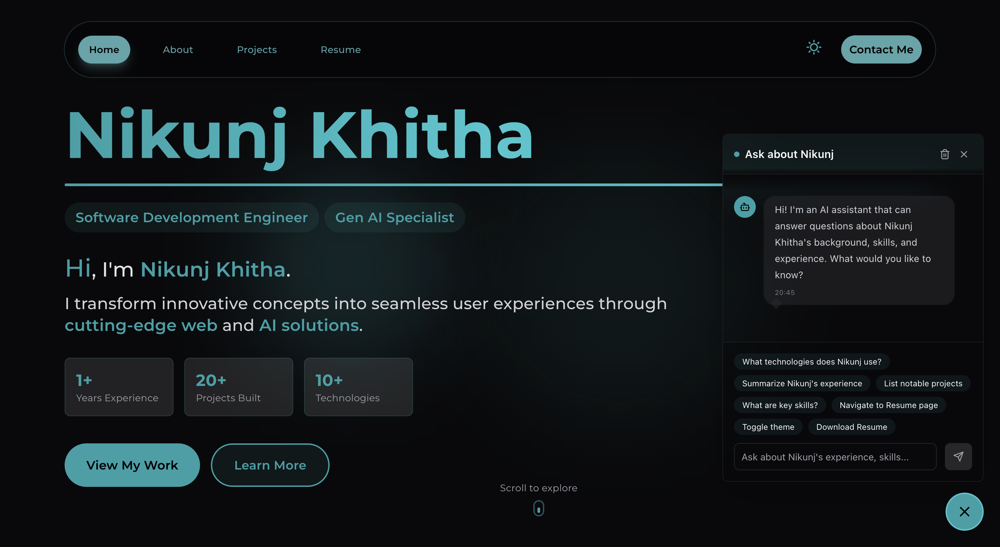

<div align="center">

# 🌐 Nikunj Khitha – Developer & AI Portfolio

An interactive, animated developer portfolio built with **Next.js**. Clean sections for About, Projects, Skills, and Resume with a modern, responsive design.



</div>

---

## ✨ Feature Highlights

### 1. 🤖 AI Portfolio Assistant
Interactive floating chat (see `src/components/chat/`) powered by an LLM (`meta/llama-3.1-70b-instruct`) with:
- Context‑aware responses constrained to professional info (configured in `src/config/ai.ts`)
- Conversation history & graceful fallback messaging (`ai-chat-responses.ts`)
- Tool/action architecture: AI can request UI actions (navigate / scroll / theme switch / modal / download) – normalized & displayed with rich status indicators (`navigation-indicator.tsx`)
- Execution feedback UI: expandable success/error panels with action summaries
- Accessibility & reduced‑motion awareness

### 2. 🧭 Action & Tool System
Structured types in `src/types/tools.ts` define:
- Strongly typed `ToolContext`, `ToolAction`, `ToolResult`, and execution metadata
- Extensible pattern for adding future tools (e.g., focus/highlight)
- Normalization of action variants for resilient AI function calling

### 3. 📝 Animated Resume Module
`resume-display.tsx` renders a theme‑adaptive, animated resume within the **site‑wide glassmorphism design language**:
- Staggered Framer Motion reveals
- Smooth in‑page hash scrolling
- Responsive layout & iconography (Lucide)
- Shares global frosted surfaces & layered blur gradients used across navbar, overlays, chat, transitions

### 4. 🎬 Micro‑interaction Animations
Custom animation utilities in `src/animation/` (fade, flip words, page transitions) plus Framer Motion orchestration for:
- Section transitions
- Floating chat open/close morph transitions
- Scroll & action notifications

### 5. 🎨 Theming & Design System
- Dark/light theme via `next-themes`
- TailwindCSS utility‑first styling with accent-driven gradients
- Reusable helper `classNames` utility
 - Site‑wide glassmorphism: layered translucent panels, subtle borders, backdrop blurs

### 6. 📧 Contact & Email (Nodemailer)
- Configurable email transport via environment variables
- Rate limiting to prevent abuse (see below)

### 7. 🛡️ Smart Rate Limiting
`rate-limiter.ts` (LRU cache based) provides per-user/IP + UA throttling with graceful headers & cookie fallback.

### 8. 🔍 SEO Automation
- Automated generation of `sitemap.xml` & `robots.txt` via `src/scripts/generateSitemap.mjs`
- Dynamic route exclusion by convention
- Google Site Verification configurable in `src/data/siteMetaData.mjs`

### 9. ✅ Testing
- Jest + React Testing Library test suite (see `src/components/chat/__tests__/`) covering interactive chat components & dialogs

### 10. 📦 Deployment Ready
- Optimized for **Vercel** (edge friendly, Next.js defaults)
- Static assets & icons organized under `public/`

### 11. ♿ Accessibility & UX Enhancements
- Reduced motion support via `useReducedMotion`
- Keyboard accessible chat trigger & ARIA labels
- Scroll anchoring & auto‑sizing textarea (`useAutoSizeTextarea`)

### 12. 🔧 Extensibility Strategy
- Central AI system prompt governs boundaries & formatting
- Pluggable tool execution pattern allows future actions (focus/highlight/show/hide) with minimal changes

### 13. ⚙️ Component Architecture (Non‑AI Core)
- Modular section components: hero, about, experience, projects, skills, resume
- Shared layout primitives (`main-layout`, `navbar`, `footer`) for consistency
- Reusable animation variants to avoid duplication
- Data-driven sections sourced from TypeScript files in `src/data/` (no hard-coded JSX blobs)

### 14. 🚀 Performance Mindset
- Lean image usage; static assets optimized under `public/`
- Conditional rendering for heavy components (chat window mounts only when opened)
- Auto-scroll management to prevent layout thrash
- Potential to integrate Next.js `<Image />` for further optimization (future enhancement)

### 15. 🧹 Code Quality & Maintainability
- Strong typing across utilities & tool system
- Separation of concerns: UI vs. domain logic vs. configuration
- Centralized constants & metadata (`siteMetaData.mjs`, `ai.ts`)
- Clear naming + comments for complex behaviors (tool execution, scrolling)

### 16. ♿ Accessibility & Semantics (Beyond Chat)
- Semantic headings & icon labels with `aria-label`
- Color contrasts tuned for dark/light themes
- Motion reduced when user prefers reduced motion
- Focusable floating action button with clear state indication

### 17. 🎞️ Animation Philosophy
- Subtle motion for first-impression polish (resume, hero, chat open)
- Avoids perpetual CPU-heavy animations; most transitions are spring-based and finite
- Encapsulated variants enabling consistent timing curves

### 18. 🔐 Security / Resilience Considerations
- Rate limiting on AI endpoint
- Graceful fallback messaging when AI or tools fail
- Environment variable isolation via `.env.local` (example provided)

### 19. 🧭 Navigation UX
- Smooth in-page hash scrolling
- AI assisted scroll-to-section actions (planned highlight/focus tools)
- Clear active route boundaries in the navbar (implementation detail in layout components)

### 20. 🪟 Welcome Intro Overlay
`welcome-screen.tsx` provides a first‑visit immersive intro:
- Scroll/touch to dismiss interaction
- Rotating inspirational taglines with timed transitions
- Scroll lock handling + graceful teardown
- Dynamic floating particles & gradient orbs with reduced‑motion awareness

### 21. 🔄 Page Transition Portal
`page-transition-animation.tsx` adds cinematic route transitions:
- Layered radial clipPath reveals & gradient overlays
- Animated sparkle core with orbiting particles & radiating rings
- Automatically skipped when user prefers reduced motion
- Elevates perceived performance & brand identity

### 22. 🧊 Global Glassmorphism Aesthetic
- Consistent translucent surfaces (welcome overlay, chat window, resume container, transition panels)
- Light/dark adaptive accent hues with subtle inner/outer shadow blending
- Avoids excessive blur radius for performance while retaining depth

### 23. 📄 Pages Overview
Route | Purpose
----- | -------
`/` (Home) | Landing hero, skills snapshot, featured sections, AI chat entry
`/about` | Detailed background, narrative profile
`/projects` | Project gallery sourced from `src/data/projects.ts`
`/resume` | Interactive animated resume (`resume-display.tsx`)
`/404` | Custom not‑found with consistent styling
API routes (`/api/*`) | Chat endpoint, email sending (rate limited)

---

## 🖥️ Technology Stack

- **Next.js** – Hybrid rendering & routing
- **TypeScript** – Type safety & maintainability
- **Tailwind CSS** – Rapid UI styling
- **Framer Motion** – Declarative animations
- **Lucide Icons** – Consistent icon set
- **Nodemailer** – Contact form delivery
- **LLM (Llama 3.1)** – Conversational AI layer
- **Jest / RTL** – Component testing

---

## 🤖 AI Assistant Architecture
File | Purpose
--- | ---
`src/config/ai.ts` | Model + guarded system prompt
`src/utility/ai-chat-responses.ts` | Fetch + fallback strategy & conversation windowing
`src/types/tools.ts` | Typed contracts for tool calls & results
`src/components/chat/` | UI (window, floating button, indicators, dialogs)

Core flow:
1. User asks a question → message appended locally
2. API routes handle contact form submissions and sitemap generation
3. AI returns text + optional structured tool action intents
4. Actions normalized → queued → visualized → executed (navigate, scroll, theme, etc.)
5. Result blocks rendered with success/error details & action logs

Add a new tool:
1. Extend `ToolAction['type']`
2. Implement execution & UI mapping
3. Update normalization and indicator icon selection

---

## ✨ SEO Details
1. Run generation manually: `npm run sitemap` (or via build hook)
2. Dynamic `[slug]` / bracket paths automatically excluded
3. Update Google site verification token in `src/data/siteMetaData.mjs`

---

## 🔐 Environment Variables
Create a `.env.local` (not committed). See `.env.example` for the full annotated list.

```bash
# Example environment variables for the portfolio
# Copy this file to .env.local (never commit real secrets)

# -----------------------------
# Contact / Nodemailer (Gmail example)
# If using Gmail with 2FA, use an App Password instead of your real password.
NODEMAILER_USER=your-email@example.com
NODEMAILER_PASS=your-app-password

# -----------------------------
# LLM / AI Provider
# Base URL optional – set if you proxy or self-host (e.g. OpenAI compatible gateway)
LLM_API_KEY=your-llm-api-key
LLM_BASE_URL=https://api.openai.com/v1

# -----------------------------
# Build / Analysis Flags (optional)
# Set to "true" to enable bundle analyzer as configured in next.config.js
ANALYZE=false
# Output standalone server build (useful for Docker / minimal deploy)
BUILD_STANDALONE=false

# -----------------------------
# Runtime Environment (auto-set by Vercel / Node usually; here for clarity)
NODE_ENV=development

# Add additional variables here as you extend tool features.
```

> Never commit real credentials. For production, configure them in Vercel Project Settings.

---

## 🛠️ Development Setup

### 1. Install Dependencies
```bash
npm install
```

### 2. (Optional) Generate Sitemap
```bash
npm run sitemap
```

### 3. Start Dev Server
```bash
npm run dev
```
Visit: http://localhost:3000

### 4. Run Tests
```bash
npm test
```

---

## 🧪 Testing Philosophy
- Focus on critical interactive chat behaviors (open/close, message send, indicators)
- Prefer state-driven assertions over timing hacks
- Keep tests colocated with components (`__tests__` folders)

---

## 🧱 Project Structure (Excerpt)
```
src/
	components/
	config/         # AI model + system prompt
	data/           # SEO + site metadata
	animation/      # Reusable motion variants
	hooks/          # Custom UI hooks
	utility/        # Helpers (AI fetch, rate limiter, classNames)
	types/          # Shared TS types (tools, etc.)
public/           # Static assets & icons
```

---

## 🧩 Customization Guide
Area | How to Change
---- | -------------
Accent Theme | Tailwind config (`tailwind.config.js`)
AI Knowledge | Edit knowledge base in `src/config/ai.ts`
Resume Content | Update `resume-display.tsx` or source structured data
Tool Actions | Extend `ToolAction` in `types/tools.ts`
SEO Metadata | `src/data/siteMetaData.mjs`
Animations | Add variants under `src/animation/`
Email Transport | Update `.env.local` + `sendMail.ts` config (e.g., switch from Gmail to custom SMTP)
LLM Provider | Point `LLM_BASE_URL` & `LLM_API_KEY` to alternative (OpenAI-compatible) endpoint
Rate Limits | Tweak limiter settings in `src/utility/rate-limiter.ts`

---

## 🛡️ Rate Limiting
`rate-limiter.ts` uses an in-memory LRU strategy (inspired by official Next.js example). For production horizontal scaling, replace with Redis / Upstash / KV store.

---

## 📤 Deployment
Deploy on **Vercel**:
1. Push repository to GitHub
2. Import into Vercel
3. Add environment variables
4. Trigger build (sitemap script runs automatically if configured)

---

## 🗺️ Roadmap Ideas
- Add focus/highlight tool execution
- Streaming AI responses
- Persist conversation in session storage
- Internationalization (i18n)

---

## 📄 License
See [LICENSE](./LICENSE)

---

## 🙌 Acknowledgements
- Next.js team & examples
- Framer Motion contributors
- Lucide Icons

---

If you build on this template, a star ⭐ on the repo is always appreciated!

</br>
<div align="center">Made with passion & TypeScript ⚡</div>